Computer Engineering student at **Iowa State University**, working where hardware, software, and AI meet. I enjoy low-level programming and embedded systems, and I build web apps and AI-powered workflows on the side.

### 🔭 What I'm doing now
- Studying embedded systems, computer organization, and digital logic at ISU
- Building with LLMs and agentic tools: RAG, MCP, n8n, CrewAI, FastAPI
- 🎯 Open to **internships** in embedded systems, software engineering, or applied AI

### 🛠️ Featured projects

**[Archaeology Site Survey Rover] · *C, embedded microcontroller*
Object-scanning rover that uses servo-mounted IR and ultrasonic sensors to detect and measure objects across a 180° sweep, with real-time hazard detection from bump and cliff sensors.

**[Mind & Muscle]([https://github.com/rishirajparmar14-ux/REPO-NAME](https://github.com/rishirajparmar14-ux/MindandMuscle))** · *React, TypeScript, Tailwind CSS* · 
Responsive wellness app that helps college students balance academics and fitness, with an interactive fitness calculator, Recharts visualizations, and Framer Motion animations.

**Warehouse Asset Management System** · *Oracle APEX* · Technokrat Solutions internship
Designed and deployed a full asset-tracking system that cut manual audit work and gave the warehouse team real-time asset visibility.

### 🧰 Tech I work with
**Languages:** C · C++ · Python · JavaScript · TypeScript · VHDL · Assembly
**Web:** React · Node.js · Tailwind CSS · FastAPI · Oracle APEX
**AI:** LLMs · RAG · Agentic workflows · MCP · Ollama · CrewAI · MLflow · Databricks
**Tools:** Git · Linux · Figma · Claude Code · Cursor

### 📜 Certifications
- Google AI Professional Certificate
- BoltIOT Artificial Intelligence Certification

### 📫 Reach me
[LinkedIn](https://www.linkedin.com/in/rishiraj-parmar) · rishiraj@iastate.edu
Off the keyboard: tennis, 3D printing, art, and billiards.

